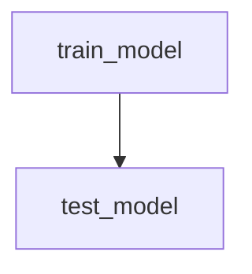

# Census Salary Prediction ML Model on Heroku with FastAPI


Author: Bernardo Carvalho <br>
Date: September 2022 <br>


## Project Description
In this project, it is applied the skills to develop a classification model on publicly available Census Bureau data. Unit tests are created to monitor the model performance on various slices of the data. Then, the model is deployed using the FastAPI package and with API tests. Both the slice-validation and the API tests are incorporated into a CI/CD framework using GitHub Actions.

## Create environment
Use the supplied requirements file to create a new environment:

```
> conda create -n [envname] --file requirements.txt
> conda activate [envname]
```

## DVC - Data Pipeline
The projects artifacts are already created, but if you want to re-run the whole code an dvc pipeline, use the following code:
```
> dvc repro
```

The pipeline that will be creates will follow this structure:




## Code Best Practices
After you pull all the files, you could pass the flake8 to check the code best practice of pep8 in every file on the directory and them use the pytest to test some functions.

```
> flake8
> pytest
```

Since these code is linked to Github Actions, we implemented these two packages as a CI functionality for every time the main branch is updated.

## Using the API
You have two options to run the API, locally via FastAPI our using the continuous deployment via heroku.

### Locally
For locally deployment, use the following code:

```
> uvicorn main:app
```
Now you are on the main page with an GET method implemented, if you want to learn our test the post method, insert after the URL '/docs':

```
> http://127.0.0.1:8000/docs
```

### CD
Since,this code is implemented on heroku, you could access the app directly in the following URL:

```
> https://census-final-prediction-app.herokuapp.com/docs#/
```

It is also possible to locally call the external API by running the heroku_app_run.py:

```
> heroku_app_run.py
```

That command sends a POST request with the input data:

```
{
     "age": 50,
    "workclass": "Private",
    "fnlgt": 210008,
    "education": "HS_grad",
    "education_num": 9,
    "marital_status": "Never_married",
    "occupation": "Sales",
    "relationship": "Own_child",
    "race": "White",
    "sex": "Female",
    "capital_gain": 0,
    "capital_loss": 0,
    "hours_per_week": 40,
    "native_country": "United_States"
  }
```
And should return 200 as response code and '<=50k' as prediction result.